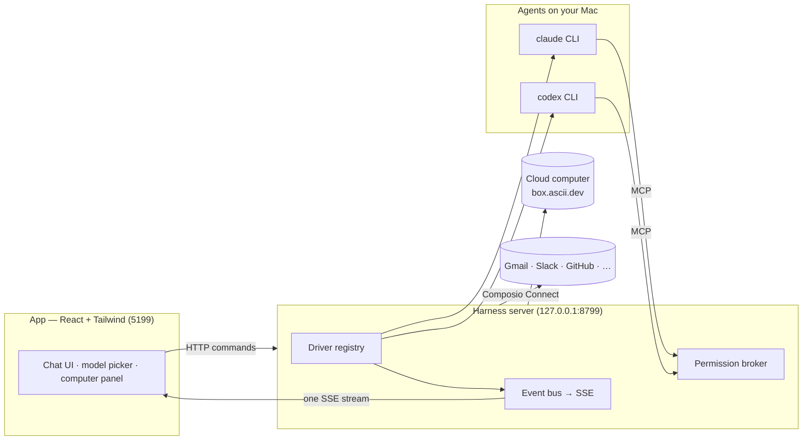

> ⚠️ **No affiliation with any cryptocurrency.** OpenMausBot has no token. Any coin using the OpenMausBot, Maus, or SupaMaus name is not created, endorsed, or affiliated with this project or its maintainer. I have received no tokens, payment, or allocation from anyone, and I will not be endorsing any token.

<div align="center">

# OpenMausBot

**Your own team of AI bots, in a chat app.**

<sub>An open-source version of **Grok Bot** — bring-your-own-agent, local-first, on the models you already have.</sub>

Every bot in the sidebar is a real agent — Claude or Codex running locally under the hood — with its own
personality, its own model, its own cloud computer, and its own connected apps.
Talk to them like contacts. Watch them work. Approve what matters.


<br>

<a href="#quick-start">
  
</a>

<sub>PowerShell · Terminal · Docker · Termux</sub>

<br>
<br>


</div>

---

## Why

One assistant in one box is the wrong shape for agents. OpenMausBot is an open-source take on **Grok Bot** —
it keeps the idea (AI as a *messaging app*: a roster of bots you chat with, each with its own personality,
memory of its thread, model, computer, and apps) and rebuilds it open, local-first, and on the agents you
already have:

- **Bring your own agents.** Bots run on the `claude`, `codex`, and `grok` CLIs installed on your Mac — your
  existing logins and subscriptions, no new accounts, no proxy in the middle.
- **Local first.** One small harness server on `127.0.0.1` owns every agent process. Transcripts, keys, and
  events live in `~/.openmausbot`, not a cloud.
- **Agents with hands.** Each bot can get a real computer — a cloud Linux desktop it drives while you watch
  live, or your own Mac — plus 500+ apps through Composio Connect.

## Features

<table>
<tr>
<td width="50%" valign="top">

### 🧠 Pick a brain per bot

A model picker with a provider rail — Claude and Codex models side by side, defaults marked, unavailable
providers dimmed with the reason. Switch a bot's model mid-conversation.


</td>
<td width="50%" valign="top">

### 🖥️ Every bot gets a computer

Open the Computer panel and the bot's cloud desktop spins up on its own — live screen preview while it
works, "Open desktop" to take over in your browser, or point the bot at *this Mac* instead.


</td>
</tr>
<tr>
<td width="50%" valign="top">

### 🙋 Bots ask before they act

Shell commands, file edits, and questions surface as inline cards — Allow / Deny / answer in chat. A
permission broker turns every risky action into a decision you make, for cloud and local computers alike.


</td>
<td width="50%" valign="top">

### 🔌 Connected apps

A one-click marketplace over Composio Connect: Gmail, Slack, GitHub, Notion, Linear and hundreds more.
OAuth once, and every bot can use them as tools.


</td>
</tr>
<tr>
<td width="50%" valign="top">

### 🗂 Manage bots like chats

Right-click any bot: pin, mark unread, edit profile, duplicate, copy conversation ID, hide, delete. It's a
messaging app — your agents behave like contacts.


</td>
<td width="50%" valign="top">

### 🔑 Keys once, everything lights up

Paste credentials in App Settings — they persist locally and the provider fleet hot-reloads instantly.
Secrets are write-only: the UI only ever sees "configured" flags.


</td>
</tr>
</table>

**Also in the box:** streaming replies with tool-run activity chips · native macOS dictation from the
composer mic (on-device Apple speech recognition — desktop app) · SupaMaus cursor mascots with role-aware
expressions · screenshots of the bot's work folded into the transcript.

## How it works

Two processes. The app holds no transports of its own — it sends typed commands over HTTP and folds one SSE
event stream into state. The harness server owns every agent process and normalizes each provider's native
protocol into one canonical runtime event stream (logged per-thread as NDJSON).



| Layer | Where | What it does |
|---|---|---|
| Drivers | `server/drivers/` | One per provider: Claude, Codex, and Grok Build over their local CLIs (stream-JSON / JSON-RPC / ACP), plus a cloud-computer agent. Unknown drivers degrade to "unavailable", never crash the fleet. |
| Harness | `server/harness/` | Registry (configs → live instances) and the fan-in event bus every client folds. |
| API | `server/index.ts` | Bots, turns, approvals, model catalog, computer lifecycle, connectors, config — HTTP + SSE. |
| App | `src/` | The chat shell. Server-backed store, one reducer, zero client-side transports. |
| Desktop | `electron/` | macOS shell: dictation helper (SFSpeechRecognizer), local screen capture, CUA bridge. |

## Quick start

This repository is private. Authenticate GitHub for `git` once before using
these commands.

### Windows — PowerShell

Requires Git and Node.js 24+. Installs a per-user background server, starts it
on login, then opens the PWA.

```powershell
git clone https://github.com/clewkord/multibot.git; Set-Location multibot; corepack enable; pnpm install:server:windows; Start-Process http://127.0.0.1:8799
```

### macOS — Terminal

Requires Git, Node.js 24+, and Xcode Command Line Tools. Builds a local `.dmg`;
open it and drag Multibot to Applications.

```sh
git clone https://github.com/clewkord/multibot.git && cd multibot && corepack enable && pnpm install --frozen-lockfile && pnpm package && open release/*.dmg
```

### Linux / VPS — Docker

Requires Git and Docker with Compose. Runs the authenticated PWA and engine as
one container; only port `8799` is published.

```sh
git clone https://github.com/clewkord/multibot.git && cd multibot && bash scripts/install-linux.sh --mode docker
```

Without Docker, use `bash scripts/install-linux.sh` on a systemd host after
installing Node.js 24+, pnpm, Python 3, Git, and systemd.

### Android — Termux

Install Termux and Termux:Boot from F-Droid, authenticate GitHub, then run:

```sh
pkg install -y git openssh && git clone https://github.com/clewkord/multibot.git && cd multibot && bash scripts/install-termux.sh
```

Termux installs its own dependencies and registers a persistent service. Android
does not support the Playwright browser computer; chat, memory, routines, and
the PWA remain available.

Every server generates its access token automatically on first start and prints
it once. You do not create it: paste it into the first login screen, then the
browser remembers it. Keep it private. For remote HTTPS:

```sh
tailscale serve --bg --yes http://127.0.0.1:8799
```

Detailed setup, development commands, dry runs, and recovery steps:
[`MULTIBOT.md`](MULTIBOT.md).

Optional, pasted once in **App Settings** (gear in the sidebar footer):

| Key | Unlocks |
|---|---|
| Composio Connect key (`ck_…`) | The connected-apps marketplace |
| Composio API key (`ak_…`) | The full 500+ app catalog with official logos |
| Box token ([box.ascii.dev](https://box.ascii.dev)) | Cloud computers for your bots |

```sh
pnpm typecheck     # app + server
pnpm build         # typecheck + production build
```

## Status

The loop works end to end: message → agent → streamed reply → tools → approvals → computer use. Multibot
also includes custom models, memory, routines, authenticated remote access, PWA installation, and
Windows/Linux/Termux server installers. See [`MULTIBOT.md`](MULTIBOT.md) for current platform limits.

Contributions welcome — the driver SPI in [`server/contracts.ts`](server/contracts.ts) is deliberately
small; adding a provider is one file in [`server/drivers/`](server/drivers/) plus a one-line registration.

## License

[MIT](LICENSE) © 2026 Milind Soni and contributors.

OpenMausBot is an independent, open-source project inspired by Grok Bot. It is
not affiliated with, endorsed by, or associated with xAI; "Grok" is a trademark
of its respective owner.
